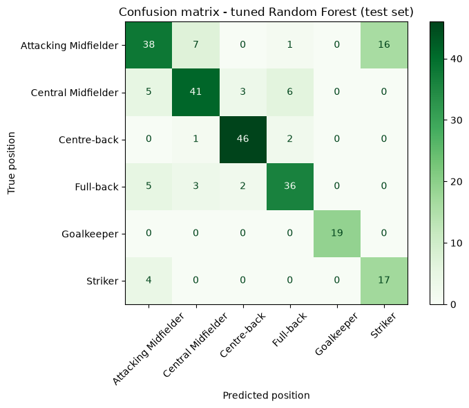
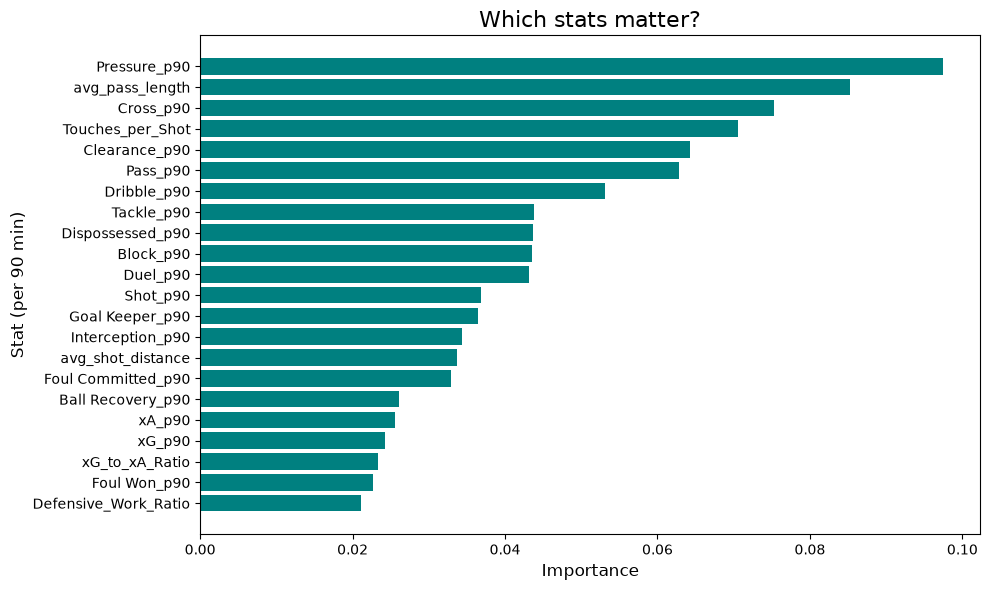

# Predicting Football Player Positions from Match Event Data

Can you tell where someone plays just from what they do on the pitch? This
project builds per-player statistics from **~458,000 raw match events** from
the 2018 and 2022 FIFA World Cups (StatsBomb open data) and trains classifiers
to predict each player's position.

**Result:** about **80% cross-validated accuracy across 6 positions**, against
a 24% baseline of always guessing the most common position.

<p align="center">
  
</p>

## Highlights

- **Built the dataset from raw events.** The input is individual passes,
  shots, pressures and substitutions, not a ready-made table. I turned it
  into per-90-minute stats for 839 players, including xA (the xG of the
  shots a player's passes set up), minutes played worked out from
  substitutions, and shot distance from pitch coordinates.
- **Evaluated honestly.** 5-fold stratified cross-validation, scaling inside
  a `Pipeline` so it's fitted on each training fold only, a baseline to
  compare against, and hyperparameters tuned with `GridSearchCV` on the
  training set. The test set is used once, at the end.
- **Found and fixed bugs in my own pipeline** (see [What I learned](#what-i-learned)).
- **Interactive demo.** A Gradio app where you set a player's stats with
  sliders and get position probabilities.

## Results

5-fold cross-validation on the training set (587 players), and accuracy on
the held-out test set (252 players):

| Model | CV accuracy | Test accuracy |
|---|---|---|
| Baseline (most frequent class) | 0.244 ± 0.004 | 0.246 |
| Logistic Regression | **0.816 ± 0.032** | 0.786 |
| **Random Forest (tuned)** | 0.802 ± 0.022 | 0.782 |
| Random Forest (initial) | 0.784 ± 0.035 | 0.770 |
| SVM (RBF) | 0.768 ± 0.049 | 0.802 |
| KNN (k=5) | 0.717 ± 0.040 | 0.742 |

The tuned Random Forest is the model behind the app. Its best settings were
`max_features=3, max_depth=None, min_samples_leaf=1, class_weight='balanced'`.

Per-class F1 on the test set:

| Goalkeeper | Centre-back | Full-back | Central Midfielder | Attacking Midfielder | Striker |
|---|---|---|---|---|---|
| 1.00 | 0.92 | 0.79 | 0.77 | 0.67 | 0.63 |

Defensive roles are easy to tell apart. Attacking roles are much harder
(see the confusion matrix above).

## What I learned

**1. The test set disagreed with cross-validation by up to 6 points.**
When I translated the class names, the stratified split sorted them
differently, so different players ended up in the test set. Test accuracy
moved by up to 6 points (KNN 0.683 → 0.742, SVM 0.758 → 0.802), while every
model's CV score moved by 1.3 points or less. With 252 test players, the gaps
between the top models are smaller than this noise. The honest conclusion is
that Logistic Regression and a tuned Random Forest perform about the same,
not that one clearly wins.

**2. Two bugs made the original results wrong.**
- *Data leakage:* the test set was standardised with its own mean and std
  instead of the training set's (`fit_transform` instead of `transform`).
- *Duplicate players:* StatsBomb spells some players differently between
  tournaments (`Phil Foden` / `Philip Foden`, `N'Golo` / `N''Golo Kanté`).
  Grouping by id *and* name split them into two rows, and a
  `drop_duplicates` then silently threw away half of their data. Each
  player id now gets a single name, and an `assert` makes sure it stays
  that way.

**3. Most errors come from how positions are labelled.** 16 of 62 attacking
midfielders are predicted as strikers. The label mapping treats
`Left/Right Center Forward`, which are strikers in a two-striker system, as
attacking midfielders. So the model is often right about how the player
plays, and the label is what's ambiguous.

**4. Tuning helped a little.** The grid search improved the Random Forest
from 0.784 to 0.802 in CV accuracy. That gain is smaller than the variation
between folds, so the model isn't very sensitive to these settings.

<p align="center">
  
</p>

The most useful stats make football sense:
- **Pressures** separate forwards, who press high, from defenders and goalkeepers.
- **Average pass length** separates goalkeepers and centre-backs, who play long balls.
- **Crosses** identify full-backs and wide players.
- **Touches per shot** separates strikers from build-up players.

## How it works

The whole pipeline is in
[`statsbomb_position_classifier.ipynb`](statsbomb_position_classifier.ipynb):

1. **Load events** for all 128 World Cup matches with `statsbombpy`, and
   cache them to Parquet.
2. **Aggregate** each player's actions: passes, shots, duels, pressures,
   tackles, crosses, xG, xA, and so on.
3. **Estimate minutes played** from substitutions, convert everything to
   **per 90 minutes**, and keep players with at least 90 minutes.
4. **Label** each player with the position they played most often, grouped
   into 6 classes:
   - Goalkeeper
   - Centre-back
   - Full-back (including wing-backs)
   - Central Midfielder (central and defensive midfielders)
   - Attacking Midfielder (attacking mids, wide mids and wingers)
   - Striker
5. **Add ratio features:**
   - Defensive work ratio = (tackles + interceptions + ball recoveries) / (passes + 1)
   - xG / xA ratio
   - Touches per shot
6. **Explore** the data with class balance, box plots per position and correlations.
7. **Model:** stratified 70/30 split, compare Random Forest, Logistic
   Regression, KNN and SVM, cross-validate, and tune the Random Forest.
8. **Demo:** a Gradio app for interactive predictions.

**Stack:** Python, pandas, NumPy, scikit-learn, matplotlib, seaborn, Gradio, statsbombpy.

## Running it

**Google Colab (easiest):** open the notebook in Colab and run all cells.
The first run downloads the event data (about 3 minutes) and caches it to
your Google Drive (`MyDrive/statsbomb_cache/`), so later runs load it in
seconds. The Random Forest grid search takes a few more minutes.

**Locally:**

```bash
pip install -r requirements.txt
jupyter notebook statsbomb_position_classifier.ipynb
```

The cache goes to `./statsbomb_cache/`. Set `FORCE_DOWNLOAD = True` in the
loading cell to download the data again.

## Limitations and next steps

- **Relabel `Left/Right Center Forward` as strikers.** This should fix the
  largest source of errors.
- **Estimate minutes played more precisely.** The current estimate ignores
  red cards and handles stoppage time inconsistently.
- **Test on club competitions.** StatsBomb's open data also includes club
  leagues, which would show whether the model generalises beyond
  international tournaments.
- **Look at the misclassified players.** For example, full-backs the model
  sees as midfielders may be tactically interesting.

A full list of the issues found during review, and how they were fixed, is
in [`docs/code-review.md`](docs/code-review.md).

## Data

Event data from [StatsBomb Open Data](https://github.com/statsbomb/open-data),
used under their open data licence.
